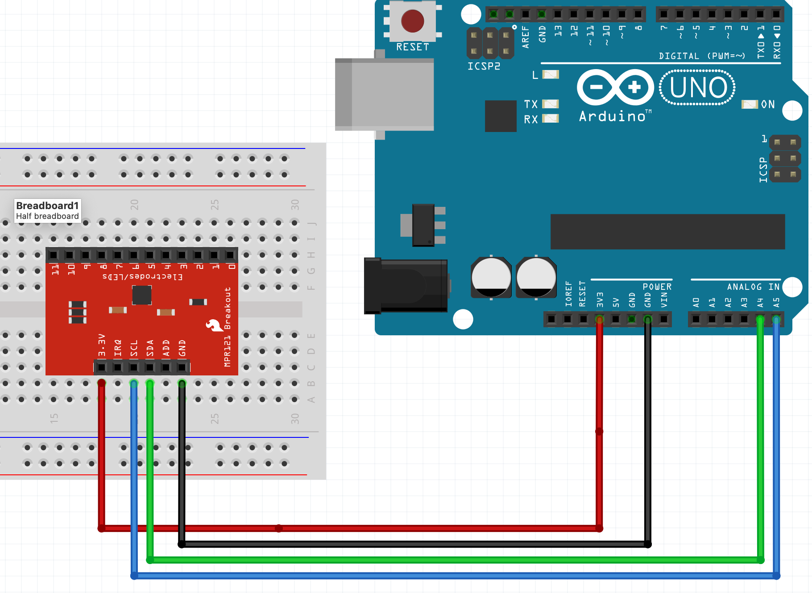

### MPR121 Capacitance Sensor
##### Capacitance touch sensors work by sensing the tiny bit of electrical charge that's in our bodies. When you get close to the sensor, it can feel that electricity, and it knows you're there. So, when you touch the sensor, it tells the light to turn on. It's like having a secret superpower to control things by just getting near them!

[Instructions on using MPR121 sensor breakout board](https://learn.adafruit.com/adafruit-mpr121-12-key-capacitive-touch-sensor-breakout-tutorial/wiring)

